## 1 两数之和

1. (实现方法一)双层循环暴力解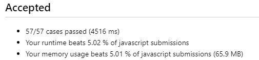
2. (实现方法二)用 Map 实现,学过 Map\且掌握了,但是不会用来解题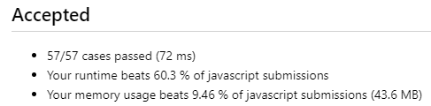
3. (实现方法三)用 Object 实现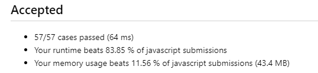
4. 无论是 Object 实现,还是 Map 实现,看似是求两数之和
   1. 实则要有两数之差的理念
   2. 将值作为键,索引作为值存入 Map 对象和 Object 对象

## 704 二分查找

1. tips
   1. while 循环条件有没有=
   2. if 条件是 middle-1 还是 middle
2. 左闭右开?左闭右闭?两种情况写代码
3. int 型相加越界?
4. (实现方法一)二分查找左闭右闭实现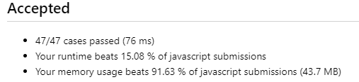
5. (实现方法二)二分查找左闭右开实现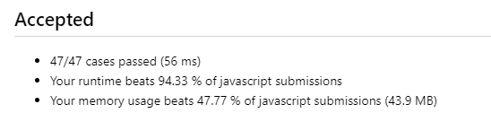,比较发现左闭右开实现效果更好
6. 两次调整
   1. 第一次调整:js 中输出小数!不会自动向下取整;加上 parseInt()强制类型转换
   2. 第二次调整:考虑 target 不存在的情况[没认真看题目:如果目标值存在返回下标，否则返回 -1]

## 4 寻找两个正序数组的中位数

1. 一些知识点的巩固
   1. 数组解构再合并,新数组长度是两个原数组长度之和
   2. sort 方法,是生成新数组;sort 方法的时间复杂度
2. 一次调整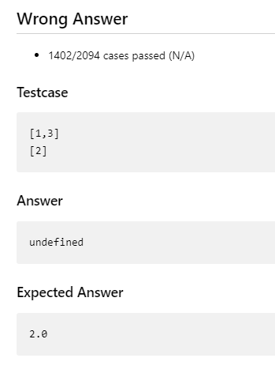
   1. 第一次调整:取数组中的元素的索引只能是整数,加上 parseInt()强制类型转换,或者 Math.floor()
3. (实现方法一)时间复杂度不符合要求(m+n)log(m+n).数组结构合并,sort 方法对数组进行排序,分两类情况返回中位数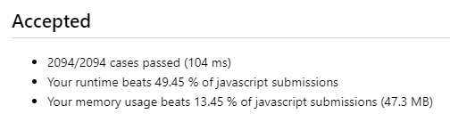
   - 自己也意识到了,没有利用到原本的两个数组是有序的,这个条件
4. (实现方法二)88 题,利用归并排序实现,合并两个有序数组,时间复杂度 O(n+m)
5. (实现方法三)二分法,时间复杂度 O(log(min(m,n))),不需要完全合并两个数组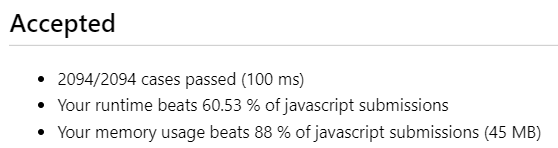
   1. 看到时间复杂度要求 log,就要想到二分
   2. 无论是一个数组还是两个数组,都可以利用二分查找的思想;把数组分成两个部分,始终保持一个规则(左右个数相等或者左少一或者左多一),此外保证左边所有元素<=右边所有元素.(用以下任意一种逻辑都可以实现)
      1. 保证第一个数组的左边的最大元素<=第二个数组的右边的最小元素
      2. 保证第二个数组的左边的最大元素<=第一个数组的右边的最小元素
   3. 针对总长度分情况
      1. 总长度为奇数,如果左边多一个元素,则左边最大的是中位数
      2. 总长度为偶数,则左边最大和右边最小的均值为中位数
   4. 用下取整,可以不用对总长度是奇数还是偶数进行讨论?
      1. Math.floor((m+n+1)/2)
   5. 要保证较短数组的左右两侧都有元素,因此以较短的数组确定分割线位置;若无法保证有元素,需要进行特殊讨论
6. 最后自己写出来了,但是还是那个边界条件不理解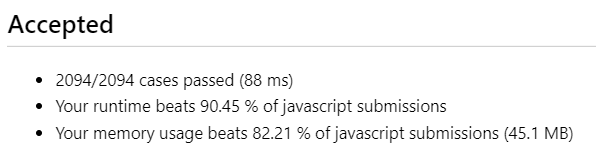
   1. 几种边界条件处理:1）数组为空，所以没有元素可以访问；2）数组的索引越界，也就是你想访问的元素的位置超出了数组的长度
   2. 以这个为例`let maxLeft1 = mid1 === 0 ? Number.MIN_SAFE_INTEGER : nums1[mid1 - 1]`
   3. 当 mid1=0,也就是左边没有元素的时候,将 maxLeft1 赋值为 JavaScript 能表示的最小安全整数,这样保证了 maxLeft1 一定小于 minRight2,从而不会影响中位数的结果(在判断是否符合二分条件的时候有用)

## 26 删除有序数组中的重复项 !

1. for 循环加 splice 删除元素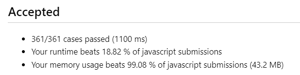
   1. 看似只遍历一次数组,但是 splice 方法的时间复杂度是 O(n),而且嵌套在 for 循环内
2. 直接原地赋值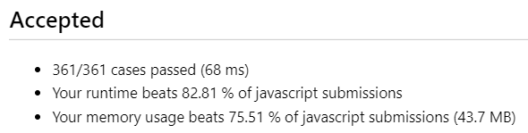
   1. for 循环的循环变量是一个指针,变量 i 是一个指针,使用双指针实现(双指针法特别适合于遍历数组时进行比较的情况)
   2. 一个快指针一个慢指针,慢指针指向当前处理的元素位置,快指针指向寻找新的不同元素的位置
   3. 本题特征:有序数组,所以相同元素必相邻
3. 没有关注到题目中的信息:**不需要考虑数组中超出新长度后面的元素**,其实后面的数组元素根本就保持,并没有被删除,只需要考虑前 k 个

## 27 移除元素

1. 双指针,融会贯通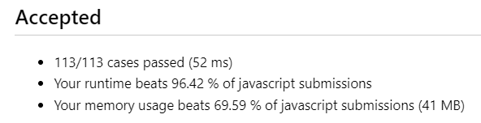

# 35 搜索插入位置

1. flag 标记是否存在比 target 小的元素,时间复杂度不符合要求,为 O(n);没有利用数组是有序的这一特征.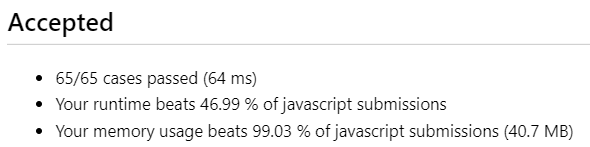
2. 看到有序数组,又要求时间复杂度为 O(logn),立马想到二分法!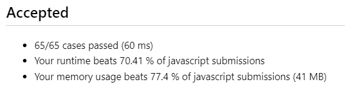
   1. 注意 middle 是下标,取值和取下标分清楚
   2. 注意和 target 比较之后,区间别反了
   3. 相等的时候记得返回值

# 66 加一 !

1. 简单情况简单处理,针对 9 特殊处理,但是发现数值太大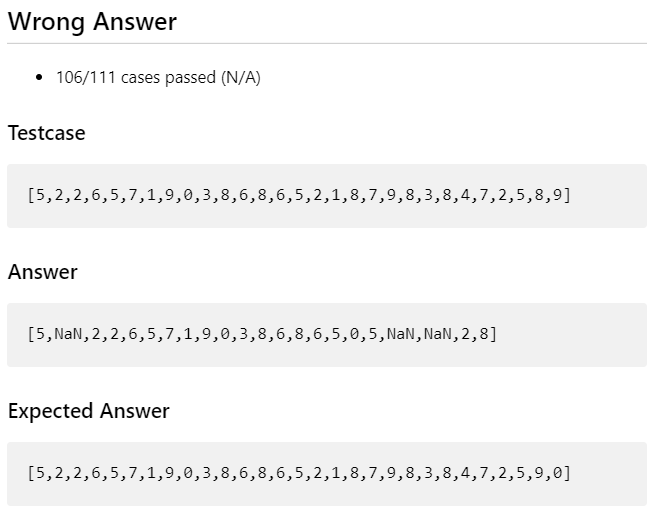
2. 尝试用 BigInt 处理,仍存在问题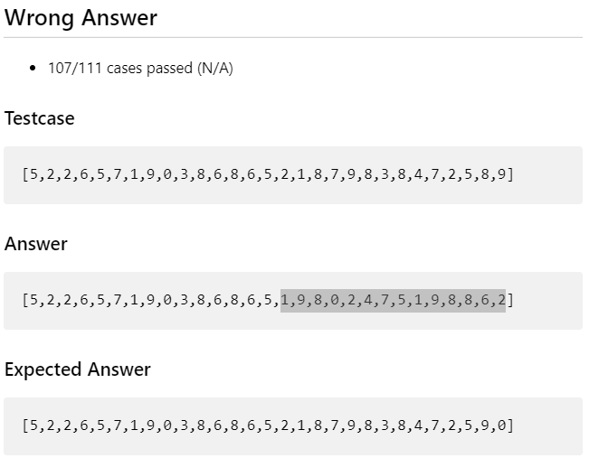,发现是 Math.pow()方法只能对 number 类型数据进行幂运算,而无法对 BigInt 运算,将 BigInt 类型转换成 Number 类型会报错 TypeError
3. 一些知识点巩固
   1. sort 是返回一个新数组
   2. reverse 是直接原地修改原数组
4. 找不出问题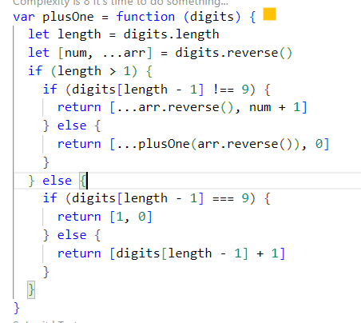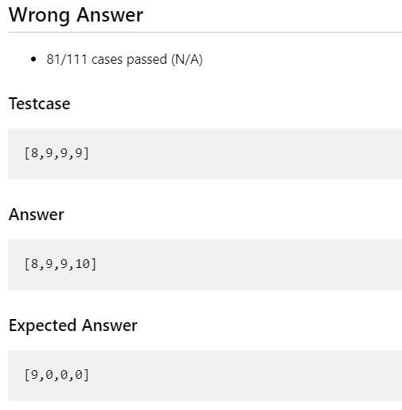
