## 两个电脑的路径不同

1. mac：/Volumes/世界如此美妙/job-orientation/leetcode

## 1 两数之和 + +

1. (实现方法一)双层循环暴力解
2. (实现方法二)用 Map 实现,学过 Map 且掌握了,但是不会用来解题
3. (实现方法三)用 Object 实现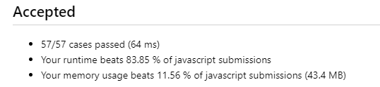
4. 无论是 Object 实现,还是 Map 实现,看似是求两数之和
   1. 实则要有两数之差的理念
   2. 将值作为键,索引作为值存入 Map 对象和 Object 对象
5. 再次实现两数之和，发现 for...in 遍历和 for(let;<;++)遍历两种，时间和空间复杂度也不尽相同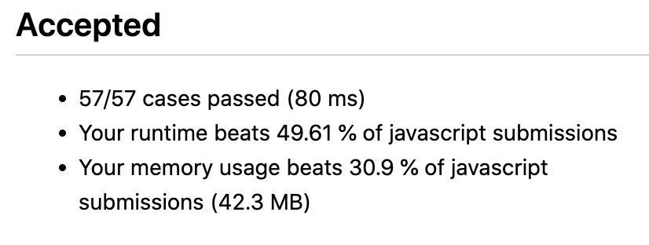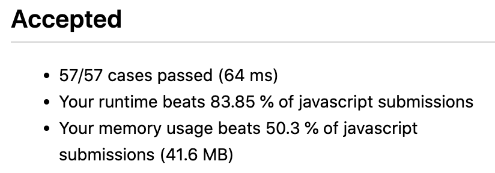
   - for...let 比 for...in 空间性能更好
6. 直接以字面量的方式创建对象{}，点运算符不会有属性和方法的自动提示，而 new Object()有自动提示；
7. 二次尝试才发现，Map 的实现和 Object 的实现不同
   1. Map 因为键的唯一性，所以只在循环的特定时候将元素和索引加到 Map 中，set 方法，会覆盖前面已经存在的键的值
   2. Object 没有唯一性要求，所以每一次循环都将元素和索引加到 Object 中
   3. 相同点就是，两者都需要先判断是否存在当前 nums[i]与 target 的差值，先处理存在的情况；只有在不存在的时候，才会将元素存入 Map 或 Object
   4. Object 没有特定的方法用于判断元素是否存在，而是直接通过[]获取值并判断是否为 undefined

## 704 二分查找 + +

1. tips
   1. while 循环条件有没有=
   2. if 条件是 middle-1 还是 middle
2. 左闭右开?左闭右闭?两种情况写代码
3. int 型相加越界?
4. (实现方法一)二分查找左闭右闭实现
5. (实现方法二)二分查找左闭右开实现,比较发现左闭右开实现效果更好
6. 两次调整
   1. 第一次调整:js 中输出小数!不会自动向下取整;加上 parseInt()强制类型转换
   2. 第二次调整:考虑 target 不存在的情况[没认真看题目:如果目标值存在返回下标，否则返回 -1]
7. 二次尝试发现，根据 nums[middle]与 target 比较的 left 和 right 的取值，要弄清楚
8. 看 top voted solution，一种不同的取 middle 方式，`let mid = lo + Math.floor((hi - lo + 1) / 2)`；且最终的目标是 lo，最终的索引包存在 lo 里面；循环条件是 `lo<ro`，性能很不错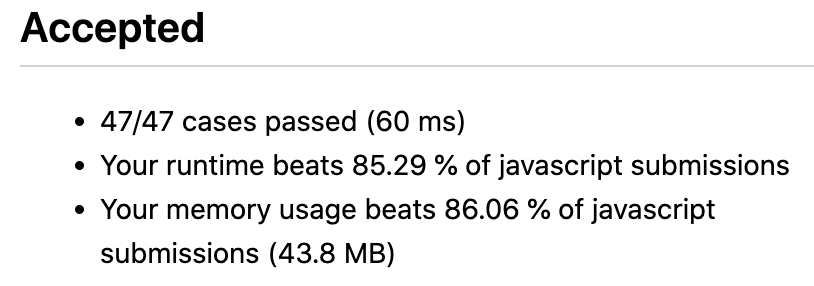

## 4 寻找两个正序数组的中位数 + +

1. 一些知识点的巩固
   1. 数组解构再合并,新数组长度是两个原数组长度之和
   2. sort 方法,是生成新数组;sort 方法的时间复杂度
2. 一次调整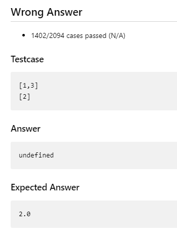
   1. 第一次调整:取数组中的元素的索引只能是整数,加上 parseInt()强制类型转换,或者 Math.floor()
3. (实现方法一)时间复杂度不符合要求(m+n)log(m+n).数组结构合并,sort 方法对数组进行排序,分两类情况返回中位数
   - 自己也意识到了,没有利用到原本的两个数组是有序的,这个条件
4. (实现方法二)88 题,利用归并排序实现,合并两个有序数组,时间复杂度 O(n+m)
5. (实现方法三)二分法,时间复杂度 O(log(min(m,n))),不需要完全合并两个数组
   1. 看到时间复杂度要求 log,就要想到二分
   2. 无论是一个数组还是两个数组,都可以利用二分查找的思想;把数组分成两个部分,始终保持一个规则(左右个数相等或者左少一或者左多一),此外保证左边所有元素<=右边所有元素.(用以下任意一种逻辑都可以实现)
      1. 保证第一个数组的左边的最大元素<=第二个数组的右边的最小元素
      2. 保证第二个数组的左边的最大元素<=第一个数组的右边的最小元素
   3. 针对总长度分情况
      1. 总长度为奇数,如果左边多一个元素,则左边最大的是中位数
      2. 总长度为偶数,则左边最大和右边最小的均值为中位数
   4. 用下取整,可以不用对总长度是奇数还是偶数进行讨论?
      1. Math.floor((m+n+1)/2)
   5. 要保证较短数组的左右两侧都有元素,因此以较短的数组确定分割线位置;若无法保证有元素,需要进行特殊讨论
6. 最后自己写出来了,但是还是那个边界条件不理解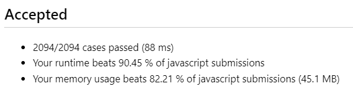
   1. 几种边界条件处理:1）数组为空，所以没有元素可以访问；2）数组的索引越界，也就是你想访问的元素的位置超出了数组的长度
   2. 以这个为例`let maxLeft1 = mid1 === 0 ? Number.MIN_SAFE_INTEGER : nums1[mid1 - 1]`
   3. 当 mid1=0,也就是左边没有元素的时候,将 maxLeft1 赋值为 JavaScript 能表示的最小安全整数,这样保证了 maxLeft1 一定小于 minRight2,从而不会影响中位数的结果(在判断是否符合二分条件的时候有用)
7. 二次尝试，还是不清楚，存在较多问题
   1. right 是将 n1 作为初始值
   2. 四个变量是通过 mid1&mid2 与 0 和 n1&n2 比较
   3. 赋极端值有两个意义
      1. 判断是否找到最终分割点，排除边界
      2. 取中位数值的时候，排除边界
   4. 数组总长为偶数，不需要 Math.floor
   5. while 循环里面没找到时，反过来用 mid1 来更新 left 和 right 值
      1. 如果 nums1 左边的最大值比 nums2 的右边最小值大，将 left 赋值为 mid1-1
      2. 同理
   6. 不要忘记边界处理，也就是最外层 return -1

## 26 删除有序数组中的重复项 + + ✔

1. for 循环加 splice 删除元素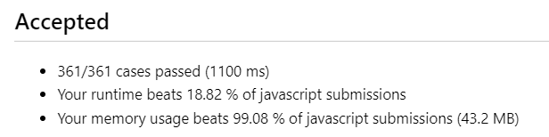
   1. 看似只遍历一次数组,但是 splice 方法的时间复杂度是 O(n),而且嵌套在 for 循环内
2. 直接原地赋值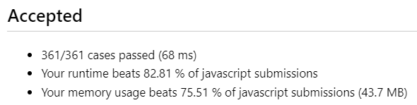
   1. for 循环的循环变量是一个指针,变量 i 是一个指针,使用双指针实现(双指针法特别适合于遍历数组时进行比较的情况)
   2. 一个快指针一个慢指针,慢指针指向当前处理的元素位置,快指针指向寻找新的不同元素的位置
   3. 本题特征:有序数组,所以相同元素必相邻
3. 没有关注到题目中的信息:**不需要考虑数组中超出新长度后面的元素**,其实后面的数组元素根本就保持,并没有被删除,只需要考虑前 k 个
4. 二次尝试，秒了

## 27 移除元素 + + ✔

1. 双指针,融会贯通
2. 二次尝试秒了

## 35 搜索插入位置 + + ✔

1. flag 标记是否存在比 target 小的元素,时间复杂度不符合要求,为 O(n);没有利用数组是有序的这一特征.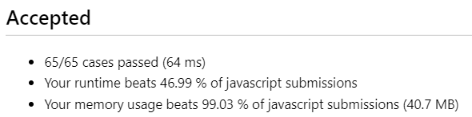
2. 看到有序数组,又要求时间复杂度为 O(logn),立马想到二分法!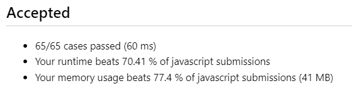
   1. 注意 middle 是下标,取值和取下标分清楚
   2. 注意和 target 比较之后,区间别反了
   3. 相等的时候记得返回值
3. 二次尝试，想了一下，秒了

## 66 加一 + +

1. 简单情况简单处理,针对 9 特殊处理,但是发现数值太大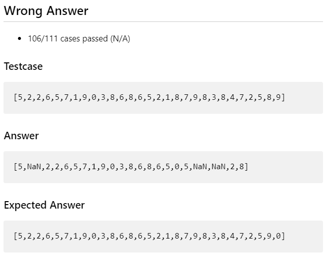
2. 尝试用 BigInt 处理,仍存在问题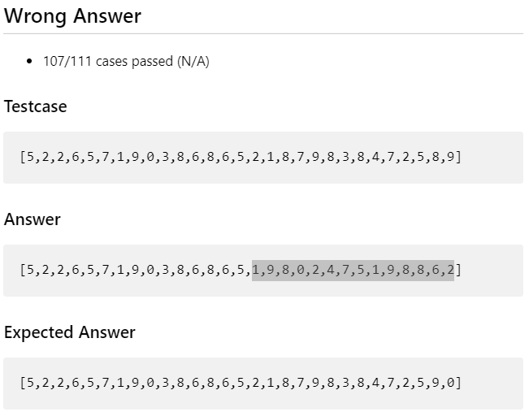,发现是 Math.pow()方法只能对 number 类型数据进行幂运算,而无法对 BigInt 运算,将 BigInt 类型转换成 Number 类型会报错 TypeError
3. 一些知识点巩固
   1. sort 是返回一个新数组
   2. reverse 是直接原地修改原数组
4. 找不出问题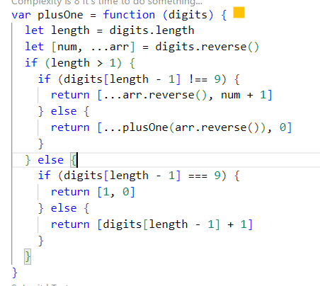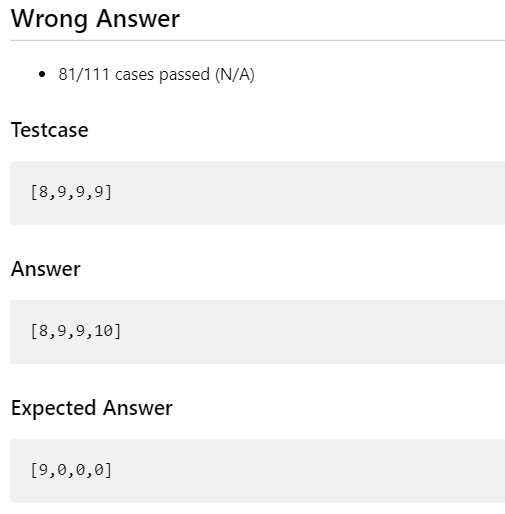
5. 我的最终解法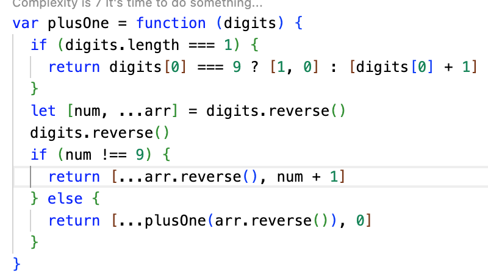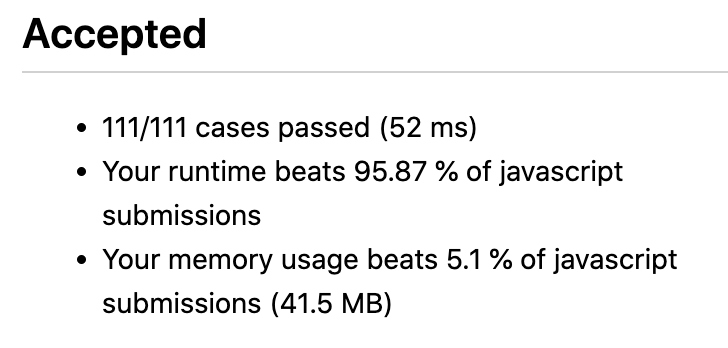
   1. 对长度为 1 的单独判断
   2. 逆序判断 num 是否为 9，是 9 则置 0 并递归，不是 9 则 num+1 直接返回
6. top voted solution，直接在原数组上操作，每一位都是 9 的情况，在 for 循环结束的时候 return，同时要在数组前面添加一个 1，因为要补位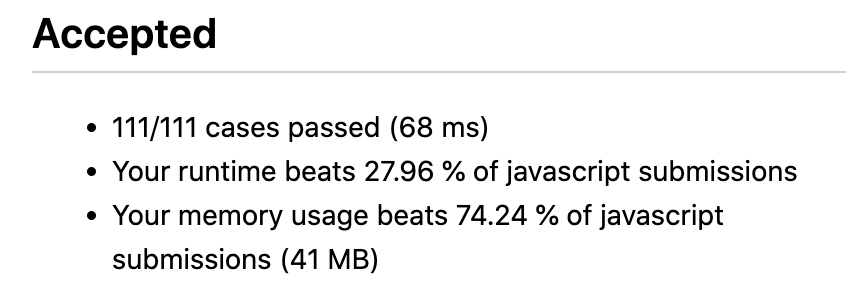
7. 二次尝试 unshift 方法知识点巩固
   1. unshift 方法是直接在原数组上面修改
   2. 所以需要先原地修改，再将 digits 返回（分两步）

## 88 合并两个有序数组 +

1. 思考的方式
2. 边界条件的考虑，总是不关注题目的数据范围：0 <= m, n <= 200
3. splice 不熟悉：返回被删除的元素,在原数组上修改
4. 考虑到了两个指针，考虑到了从后面开始赋值
5. 做出来了，效果很差，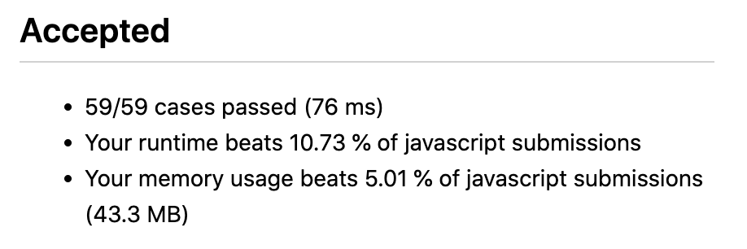
6. 直接合并后 sort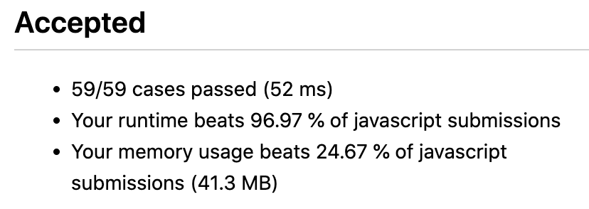
   - JavaScript 的内置方法 sort 方法，在大多数浏览器中，平均时间复杂度是 O((m+n)log(m+n))，完全不符合要求
   - 但是看起来效果很好
7. 双指针实现，while 循环，这个逻辑更精简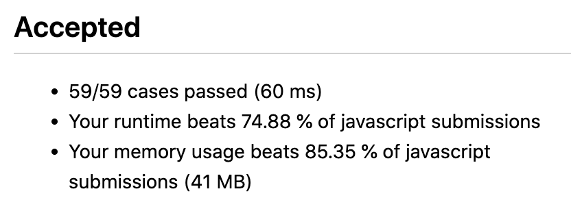
8. 一些数组知识
   1. 想要在原数组上修改数据，不会实现
9. 终于做出来了，也是用双指针，达到了所要求的时间复杂度
   - 正因为会处理 nums2 中的剩余元素，也就不需要单独考虑 m=0 了
10. 基于上面方法，进一步优化

## 118 杨辉三角 +

1. 先初始化所有的 1，不然后面没办法加，两次双层循环
2. 记住相加逻辑`arr[i][j] = arr[i - 1][j] + arr[i - 1][j - 1]`
3. top voted solution 的小技巧
   1. 通过 `res.push(Array(i + 1))`初始化，在添加二维数组的基础上，限定了数组的元素个数
   2. 没有两次双层循环，而是 if-else，因为在计算到某个 arr[i][j]的时候，必然得到了`arr[i - 1][j]` 和 `arr[i - 1][j - 1]`，理解清楚这层关系；必然是从第一行开始创建~
4. 逻辑还很不熟练
5. top voted solution
   1. 就是双层 for 循环
   2. if-else 两种情况进行赋值，赋 1 的写在前面

## 119 杨辉三角 Ⅱ +

1. 不会做
2. 只会用和上面同样的方法
3. top voted solution

## 121 买股票的最佳时机 （做不出）+

1. Math.max()方法要将一个个数传进去，所以数组要用扩展运算符
2. 我的方法一，将每一个元素与后面的所有元素组成的数组进行比较，得出一个最大值，但是超出时间限制
3. 我的方法二，将数组的数值和索引存入对象，并对数组进行排序，好像难以实现？
4. 我的方法三，直接找出元素的最大值，如果它的索引不为 0，就找出下标比他小的数组最小值；[3,3,5,0,0,3,1,4]这个例子推翻了我的方法。
5. 用新方法，数组解构，递归，时间超出限制
6. 还是没掌握用栈？等数据结构代替递归
7. 自己思路不清，双指针秒了；之前考虑过双指针，但是没做出来

## 169 多数元素 +

1. map 设置元素值总要用 set 方法
2. 完成了，性能不错

## 217 存在重复元素 +

1. 和 169 实现方法一样，性能很差，主要是空间复杂度过高
2. 使用 Object，多次提交终于做对，性能也很差，和 Map 差的不行上下
3. 用两个指针的逻辑，没想清楚，没做出来
4. 用 reduce 方法，为什么 prev 会是 undefined？
5. 第二天脑子清醒，sort+双指针，秒了；但是时间复杂度不是很好

## 存在重复元素 II

1.
